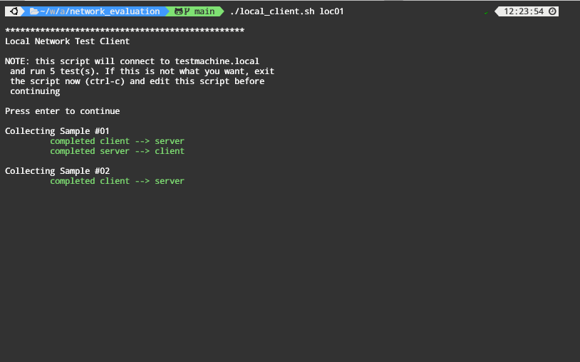

# Network Evaluation Scripts

This is a simple collection of scripts and notes supporting a simple network evaluation. These are associated with a series from my website, [Fixing My Home Network](https://robgillen.com/tags/homenetwork/).

## Setup

### Server

In order to run the evaluation tests, you need to have at least two machines. The first will be the _"server"_ and will run a copy of `iperf3` in server mode.  If you happen to be running a reasonably recent copy of Ubuntu, the [`setup_server.sh`](setup_server.sh) script should ensure you have what you need.

### Client

The _"client"_ is the machine that you will be moving around with, actually collecting the test results. This needs to be running `iperf3` as well as `speedtest`. You can install these directly, or if you happen to be running a recent copy of Ubuntu, the [`setup_client.sh`](setup_client.sh) script should get you ready.

## Local Network Evaluation

The first part of the tests involve transferring data across your network to evaluate the local performance

### Server

Running the server for this test is fairly straight forward. You simply need to run `iperf3 -s` and let it sit. If it is helpful, the [`local_server.sh`](local_server.sh) script will run this for you.

> **NOTE:** If you are running a firewall on your server (`iptables` or `ufw` or similar), you must ensure that port `5201/tcp` is open for incoming traffic.

### Client

Running the client is similarly easy, but requires a few steps.

1. You need to make a copy of `client_vars.sample` and save it as `client_vars.sh`. This file (`client_vars.sh`) must be located in the same directory as the test script (`local_client.sh`).
1. You should edit this new file and customize the properties in it to match your environment (iperf3 server, number of iterations, etc.)
1. Then, you should be able to run `./local_client.sh [identifier]` and it will run through the test loops.
   1. The `identifier` is simply a tag to uniquely identify this test collection. It could be `location01` or whatever fits.
   1. For each loop, it will collect data in both directions (client --> server, server --> client)
   1. Output files (`*.json`) will be stored in a directory named based on the current date: `./data/YYMMDD/`. For each iteration, there will be two files generated, one with a `*.f.json` and one with `*.r.json`. Here `f` is for *forward* (client --> server) and `r` is for *reverse* (server --> client). They will each be tagged with the loop/iteration number as well. An example listing is provided below. In this scenario, `loc01` was the identifier and the test ran for `3` loops:
      * loc01.01.f.json
      * loc01.01.r.json
      * loc01.02.f.json
      * loc01.02.r.json
      * loc01.03.f.json
      * loc01.03.r.json

## External/Internet Transfer Evaluation

For the Internet transfer tests, you only run the scripts on the client. The process is similar to the above with a few variations.

1. You need to make a copy of `client_vars.sample` and save it as `client_vars.sh`. This file (`client_vars.sh`) must be located in the same directory as the test script (`remote_client.sh`). If you did this in the previous step, you do not need to repeat it.
1. You should edit this new file and customize the properties in it to match your environment (speedtest server id, number of iterations, etc.)
1. Then, you should be able to run `./remote_client.sh [identifier]` and it will run through the test loops.
   1. The `identifier` is simply a tag to uniquely identify this test collection. It could be `location01` or whatever fits.
   1. Output files (`*.json`) will be stored in a directory named based on the current date: `./data/YYMMDD/`. For each iteration, there will be one file generatede with a `*.st.json` ending. Here `st` is for *speedtest* and is provided such that you could use the same identifier for your internal tests and external tests in the same location without having files overwritten. They will each be tagged with the loop/iteration number as well. An example listing is provided below. In this scenario, `loc01` was the identifier and the test ran for `3` loops:
      * loc01.01.st.json
      * loc01.02.st.json
      * loc01.03.st.json

## Analysis

Having collected the data using the tools above, here's where we generate the reports and review the data. For the example analysis, I have 10 different testing locations. The first five are hard-wired, and the second 5 are wireless, each with 4 different networks available. The data will look similar for each, as they were actually all captured from the same location (wired vs. wireless still holds), but it should give you the idea of how to adapt the analysis scripts for your use.

